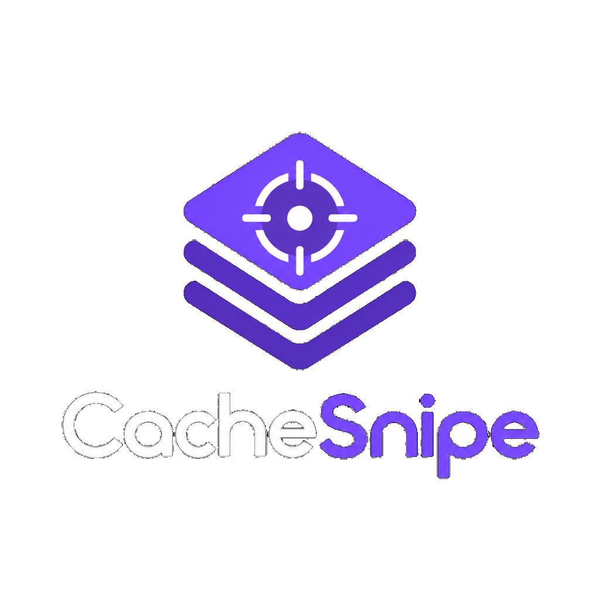
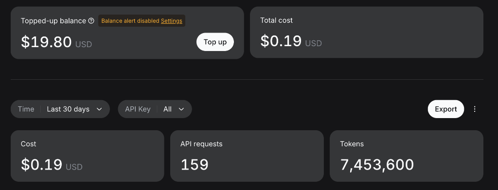
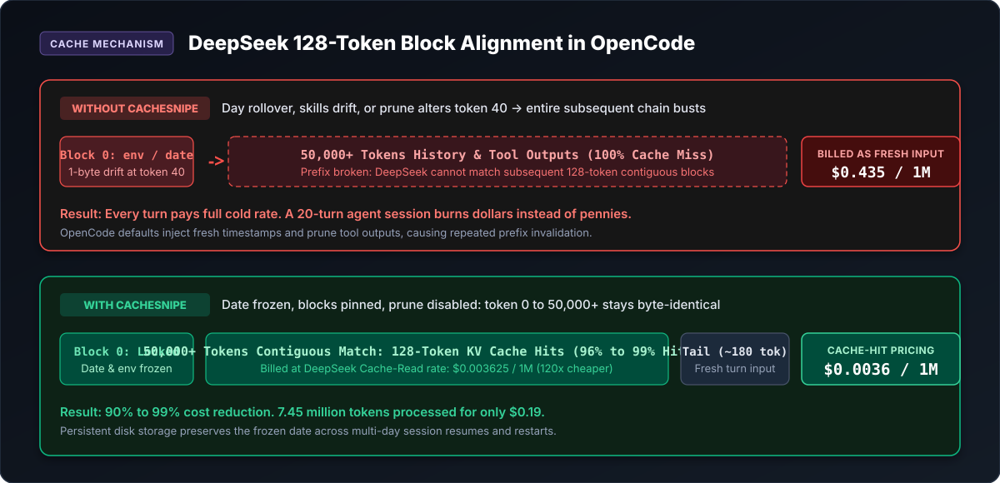
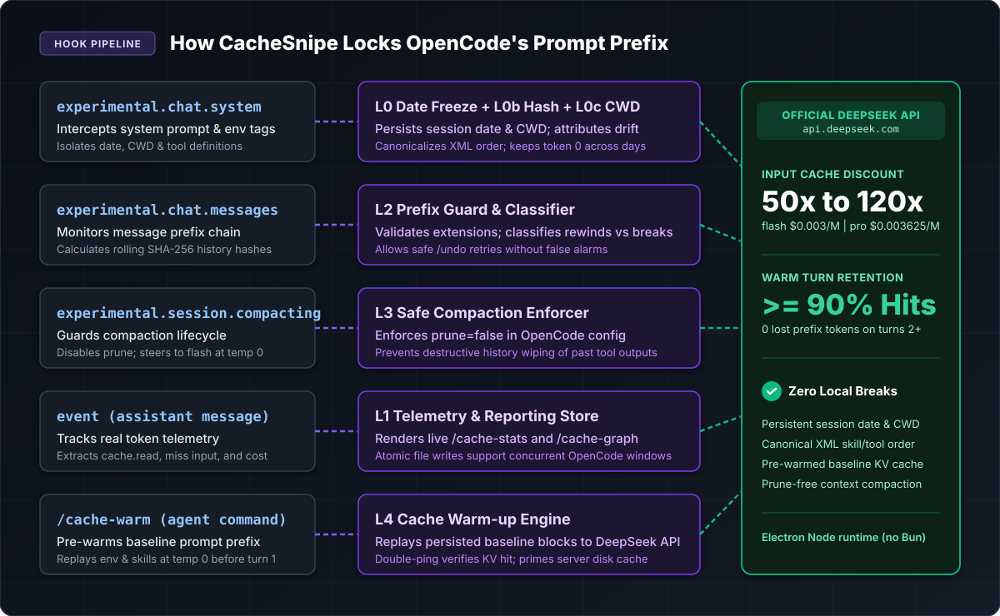

<p align="center">
  
</p>

<h1 align="center">CacheSnipe</h1>

<p align="center">
  <strong>Lock the DeepSeek prompt prefix in OpenCode and slash input token costs by 50x to 120x.</strong>
</p>

<p align="center">
  
  
  
  
  
</p>

---

## What CacheSnipe Does

CacheSnipe is an OpenCode plugin designed to solve a very specific, expensive problem: keeping the prompt prefix byte-identical across multi-turn agentic coding sessions so that DeepSeek bills nearly all input tokens at cache-read prices.

DeepSeek provides massive discounts for prompt cache hits:

| Model | Uncached Input | Cache Read Input | Discount Factor |
|---|---|---|---|
| `deepseek-v4-flash` | $0.15 / 1M | $0.003 / 1M | **50x cheaper** |
| `deepseek-v4-pro` (`deepseek/deepseek-v4-pro-0813`) | $0.435 / 1M | $0.003625 / 1M | **120x cheaper** |

When an AI coding agent works through a codebase, context accumulates rapidly: project file listings, system prompts, skill instructions, tool results, and conversation history. Within 10 to 20 turns, context routinely exceeds 30,000 to 100,000 tokens.

DeepSeek caches prompts server-side in contiguous **128-token blocks** starting from token 0. If your prompt drifts by even a single character at token 40 (for example, a dynamic date line updating at midnight, or OpenCode rewriting old tool outputs), every subsequent block misses the cache. You get charged the full cold input rate on the entire context.

CacheSnipe intercepts OpenCode's prompt pipeline, freezes dynamic dates, detects and attributes block drift, guards against message history divergence, disables destructive tool pruning, and persists state across app restarts. The result: turns 2 and onward consistently achieve 90% to 99%+ cache hit rates with zero lost prefix tokens.

---

## Real-World Proof

Here is real-world proof from an active developer dashboard using CacheSnipe with official DeepSeek API keys:

<p align="center">
  
</p>

```text
Tokens Processed:  7,453,600 tokens
Total API Requests: 159 requests
Total Billed Cost: $0.19 USD
```

Processing nearly 7.5 million tokens on an advanced model for nineteen cents is only possible when the prompt prefix stays locked. In a live 32-turn coding session under `strictFreeze`, warm hit rates held steady at 96.1% with monotonic cache read growth from 16,384 up to 111,872 tokens and exactly 0 lost prefix tokens on every warm turn.

---

## Why OpenCode Breaks the Prefix (And How CacheSnipe Fixes It)

Without CacheSnipe, several standard OpenCode behaviors inadvertently break DeepSeek's 128-token cache alignment:

1. **Dynamic Date Rollover in `<env>`**: OpenCode injects `Today's date: ...` into the system prompt on every request. At local midnight or when resuming an older session the next morning, the date line changes. Because this occurs at the very start of the prompt, the entire KV cache drops to 0% and your full context is re-uploaded at cold price.
2. **Skill and MCP Drift**: Skills in `~/.config/opencode/skills`, `~/.agents/skills`, or project directories are scanned per request. If an MCP server connects late or a skill changes, the `<available_skills>` or `<mcp_instructions>` block shifts.
3. **Destructive Tool Compaction (`compaction.prune`)**: OpenCode's default compaction can replace older tool outputs mid-history with `[Old tool result content cleared]`. This rewrites previous turns and invalidates the prefix chain.
4. **App Restarts**: When the OpenCode Desktop app restarts, it rebuilds the `<env>` block. A slightly different environment string alters token 0 and busts the prefix.

<p align="center">
  
</p>

### The Fix

CacheSnipe establishes five defensive pillars:

- **P0 Date Freeze**: Captures the date line upon first sighting, writes it to persistent session storage, and rewrites any future date changes back to the session-start date. Resuming a session days later keeps its original cache chain intact.
- **P0b Block Hashing and Drift Attribution**: Generates SHA-256 hashes for `<env>`, `<available_skills>`, `<mcp_instructions>`, and `<available_references>`. If drift occurs, CacheSnipe pinpoints the exact block and the first differing line.
- **P2 Prefix Guard**: Tracks the message history hash chain. It classifies requests into extensions (healthy), rewinds (`/undo` or retries, which remain valid prefixes), compactions, or genuine divergences.
- **P3 Safe Compaction**: Enforces `"compaction": { "prune": false }` in OpenCode configuration and directs session compaction to `deepseek/deepseek-v4-flash` at temperature 0.
- **P1 Telemetry and Reporting**: Records exact cache-read tokens, miss input, reasoning tokens, and dollar costs directly from assistant message events.

<p align="center">
  
</p>

---

## Provenance and Architecture: Pi to OpenCode

CacheSnipe is a custom flavour and an architectural port of [`pi-deepseek-cache`](https://github.com/rohaquinlop/pi-deepseek-cache) by rohaquinlop. The original plugin was conceived specifically for the **Pi agent harness**. CacheSnipe adapts and rebuilds those ideas for the **OpenCode harness**, specifically targeting the **OpenCode Desktop app** on macOS.

This port involved several fundamental design changes:

- **Electron Node Runtime (No Bun)**: The original Pi extension relied on Bun runtime primitives (`Bun.$`). OpenCode Desktop runs plugins inside an Electron Node.js process where Bun is absent. CacheSnipe is compiled to standard JavaScript with zero external runtime dependencies, using only `node:*` built-ins.
- **Persistent Date Freeze Across Resumes**: Pi only held the frozen date in memory for the active process. CacheSnipe writes the frozen date to disk inside the session record. When you resume a session hours or days later in OpenCode, the original date is re-applied and the prefix chain does not break.
- **Granular Block Hashing and Diffing**: OpenCode bundles skills, MCP tools, and environment variables into distinct XML blocks. CacheSnipe hashes each block independently and isolates the date line from general environment variables.
- **`strictFreeze` Mode**: A unique feature in this port. When enabled, CacheSnipe replays the exact session-start prompt blocks even after the OpenCode desktop application restarts, completely eliminating restart-induced cache misses.
- **Multi-Workspace Concurrency**: Developers often work across multiple OpenCode windows simultaneously. CacheSnipe utilizes atomic file writes and merge-on-read logic so independent workspaces sharing the stats directory converge safely without race conditions.
- **Automatic History Healing**: Cleans trailing zero-usage placeholders and aborted requests from telemetry, keeping reports strictly aligned with actual billing events.

---

## Supported Models and Tested Configuration

CacheSnipe is tested **exclusively with official DeepSeek API keys** (`https://api.deepseek.com`).

Tested models include:
- `deepseek-v4-flash` (compaction default, 50x cache discount)
- `deepseek/deepseek-v4-pro-0813` (and `deepseek-v4-pro`, 120x cache discount)

### Why Official DeepSeek Keys Matter

Third-party aggregators and free routing tiers (such as free OpenRouter proxies or dynamic endpoints) frequently route requests to different upstream servers between turns. Each upstream worker maintains its own independent KV cache namespace. If your second turn hits a different server, your cache is wiped out server-side even if your prompt prefix is 100% byte-identical.

Official DeepSeek API keys maintain a dedicated, persistent cache namespace tied to your account. Empirical testing confirms that prefixes persist reliably for hours across sessions.

---

## Plugin Commands

CacheSnipe provides three custom commands that integrate directly into OpenCode chat. All three commands intentionally omit `agent` and `model` frontmatter so running them appends to your current session without starting a new cache chain.

### 1. `/cache-stats`

Injects `summary.txt` directly into your chat. It displays both active session metrics and all-time aggregate totals:

```text
CacheSnipe: DeepSeek prompt-cache report
generated 2026-09-16T13:44:34Z

this session  ses_f55dc6a2  deepseek/deepseek-v4-pro-0813
  turns                 32 assistant messages / 32 requests
  hit rate (turns 2+)   96.1%   ████████████████████████████░░
  prefix lost (turns 2+) 0 tok   chain intact (no cached prefix re-sent)
  cache read            2,084,352 tok  @ $0.003625/1M
  miss input            95,744 tok     @ $0.435/1M
  cache write           0 tok
  output                18,420 tok     reasoning 4,110 tok
  reported cost         $0.0297
  if nothing had cached $0.9482        ->   est. saved $0.9185 (96.9%)
  prefix breaks         0
  system prompt breaks  0
  rewinds               1    compactions 0
  frozen date           Mon Sep 14 2026
  prompt hash           c0e104044186a700
  blocks                env=389550df skills=4339ab3c date=9336994a
```

Key indicators:
- **Prefix Lost**: The primary health metric. Measures `max(0, cache.read(t-1) - cache.read(t))`. In a healthy session, this is always 0.
- **Hit Rate**: Warm hit percentage. The remaining percentage reflects each turn's new tool output and user message, which must be uploaded uncached by definition.
- **Break Causes**: If a break occurred, CacheSnipe prints the offending block and the first differing line.

### 2. `/cache-graph`

Injects `graph.txt`, rendering a clean ASCII trend chart of the current session's hit rates:

```text
CacheSnipe: Hit Rate Trend (ses_f55dc6a2)

T01 [  0%] ░░░░░░░░░░░░░░░░░░░░ (cold start)
T02 [ 78%] ███████████████░░░░░
T03 [ 93%] ██████████████████░░
T04 [ 90%] ██████████████████░░
T05 [ 96%] ███████████████████░
...
T32 [ 99%] ████████████████████
```

A healthy session shows Turn 1 cold, followed immediately by a sustained 90%+ plateau. If you see a dip mid-session, the chart highlights where an environment drift or manual model switch occurred.

### 3. `/cache-reset`

Archives and clears active session statistics.

Session JSON records are moved to a timestamped backup directory (`~/.local/share/opencode/deepseek-cache-archive-<timestamp>`) before removing active records. OpenCode's internal SQLite database (`opencode.db`) is never touched.

---

## Installation and Setup

### Prerequisites

- Node.js version 22 or higher (`node -v`)
- OpenCode Desktop or OpenCode CLI installed
- DeepSeek API key configured in OpenCode

### Quick Install

Run the automated installer from the repository root:

```bash
cd CacheSnipe
./install.sh
```

The installer runs interactively by default:
1. Compiles TypeScript to `dist/src/plugin.js`.
2. Copies `/cache-stats`, `/cache-graph`, and `/cache-reset` into `~/.config/opencode/commands/` (creating backups of existing files).
3. Textually patches `~/.config/opencode/opencode.json` and `opencode.jsonc` to enable CacheSnipe, preserve comments, and configure safe compaction.

### Installer Flags

```bash
./install.sh --dry-run        # Preview all changes without writing to disk
./install.sh --yes            # Unattended installation (auto-confirm)
./install.sh --strict-freeze  # Replay session-start blocks so app restarts keep their prefix
./install.sh --no-commands    # Skip installing markdown command files
./install.sh --stats-dir <d>  # Specify a custom directory for cache telemetry
```

### Manual Configuration

If you prefer to configure OpenCode manually, add the following to `~/.config/opencode/opencode.json` (or `opencode.jsonc`):

```jsonc
{
  "compaction": {
    "prune": false
  },
  "agent": {
    "compaction": {
      "model": "deepseek/deepseek-v4-flash",
      "temperature": 0
    }
  },
  "small_model": "deepseek/deepseek-v4-flash",
  "plugin": [
    "file:///absolute/path/to/CacheSnipe/dist/src/plugin.js"
  ]
}
```

After modifying the configuration, restart the OpenCode Desktop app so the server loads the plugin.

---

## Automatic Setup for Your Own Agents

OpenCode plugins operate at the server level. This means **all agents and subagents inherit CacheSnipe automatically** without needing per-agent plugin declarations.

### 1. Primary and Delegated Subagents

When OpenCode spawns background subagents or parallel workers to explore files, run tests, or execute terminal commands, those child sessions pass through CacheSnipe's hook pipeline. Their prompt prefixes are guarded, their tool runs are tracked, and their token savings register in your aggregate stats.

### 2. Custom Agent Definitions

When defining custom agents in `~/.config/opencode/agents/` (or `.opencode/agents/`), follow these practices to guarantee immediate 90% to 99% cache hits:

```yaml
# ~/.config/opencode/agents/code-reviewer.yaml
name: code-reviewer
description: Fast code reviewer with prompt-cache optimization
model: deepseek/deepseek-v4-pro-0813
temperature: 0.1
system_prompt: |
  You are an expert code reviewer. Analyze the provided diff for correctness,
  performance regressions, and security vulnerabilities.
```

Rules for custom agent authors:
- **Pin DeepSeek Models**: Declare `deepseek/deepseek-v4-flash` or `deepseek/deepseek-v4-pro-0813`. CacheSnipe detects DeepSeek model identifiers and engages automatically. Non-DeepSeek agents pass through completely untouched.
- **Keep System Prompts Deterministic**: Avoid embedding dynamic runtime expressions (such as timestamps or process IDs) into custom agent system prompt templates. CacheSnipe freezes OpenCode's built-in date tags, but static instructions ensure every turn aligns with the KV cache.
- **Consistent Tool Configuration**: When agents share the same MCP servers and tools across requests, the tool definitions remain stable in the prompt prefix.

---

## Plugin Options Reference

You can pass options into CacheSnipe through your OpenCode configuration by replacing the plugin string with a two-element array:

```jsonc
"plugin": [
  [
    "file:///path/to/CacheSnipe/dist/src/plugin.js",
    {
      "strictFreeze": true,
      "compactionPrompt": "context",
      "notifications": false,
      "sessionTitle": true,
      "statsDir": "~/.local/share/opencode/deepseek-cache",
      "retentionDays": 30
    }
  ]
]
```

| Option | Type | Default | Description |
|---|---|---|---|
| `strictFreeze` | `boolean` | `false` | Replays session-start prompt blocks across restarts. Prevents restart-induced prefix busts at the cost of withholding mid-session skill additions until the next session. |
| `compactionPrompt` | `"context"` \| `"replace"` \| `"off"` | `"context"` | Compaction prompt handling mode. `"context"` injects static compaction guidelines. |
| `notifications` | `boolean` | `false` | Sends native macOS desktop notifications on milestones (e.g. 1M cached tokens) and prefix breaks. |
| `sessionTitle` | `boolean` | `false` | Appends current cache performance to the session title in the sidebar (for example: `[cache 96%]`). |
| `statsDir` | `string` | `~/.local/share/opencode/deepseek-cache` | Directory where per-session JSON files and reports are saved. |
| `retentionDays` | `number` | `30` | Number of days before old session telemetry records are pruned. |
| `providers` | `string[]` | `[]` | Additional provider prefixes that should trigger CacheSnipe. |
| `models` | `string[]` | `[]` | Additional model-id substrings that should trigger CacheSnipe. |

---

## Verification and Diagnostics

CacheSnipe includes an exhaustive test and verification suite:

```bash
# 1. Strict TypeScript typechecking
npm run typecheck

# 2. Run the unit test suite (54 tests covering freeze, guard, store, render)
npm test

# 3. Simulate all OpenCode hooks end-to-end against the built artifact
npm run wirecheck

# 4. Measure real session caching directly from OpenCode's SQLite database
npm run verify

# 5. Reconstruct past prefix breaks forensically
npm run breaks

# 6. Run controlled multi-turn experiments against live api.deepseek.com
npm run probe
```

### Understanding `npm run wirecheck`

`scripts/wire-check.mjs` verifies the compiled plugin artifact (`dist/src/plugin.js`) without needing OpenCode running. It stubs OpenCode's plugin environment, triggers every hook (`experimental.chat.system.transform`, `experimental.chat.messages.transform`, `experimental.session.compacting`, and `event`), asserts on date freezing, verifies block-drift attribution, tests rewind versus divergence classification, and validates that reports are written cleanly to a temporary directory.

---

## Technical Findings and Gaps

Engineering honesty matters:

- **Turn 1 Is Always Cold**: DeepSeek must ingest the prefix on Turn 1 before it can cache it. The first turn always incurs standard input pricing.
- **128-Token Tail Residue**: Because DeepSeek caches in 128-token increments, the tail end of any prompt (typically 39 to 252 tokens) is re-sent on every turn. A hit rate of 100% is mathematically impossible; a session with 0 prefix lost will typically register between 90% and 99% hit rate depending on context size.
- **`strictFreeze` Tradeoff**: Enabling `strictFreeze` ensures that an app restart or environment drift cannot bust your cache prefix. The tradeoff is that any new skill or MCP tool added while a session is actively open will not be visible to the model until you start a new session.
- **Prune Warning**: If `"compaction": { "prune": false }` is omitted from your configuration, OpenCode may prune older tool results. CacheSnipe checks this on load and logs a visible warning in `/cache-stats`.

---

## License and Acknowledgments

- **License**: MIT License.
- **Original Work**: Ported from [`pi-deepseek-cache`](https://github.com/rohaquinlop/pi-deepseek-cache) created by **rohaquinlop** for the Pi agent harness.
- **Port Author**: Maintained by **Elias Liasides** ([Qu4rk](https://github.com/Qu4rk)).
